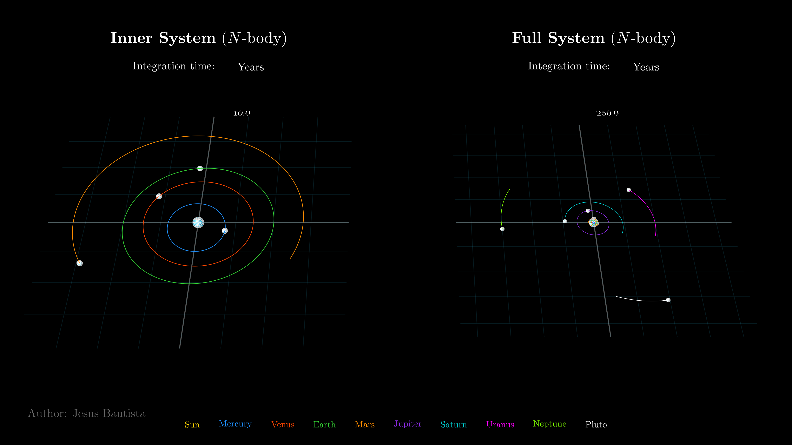
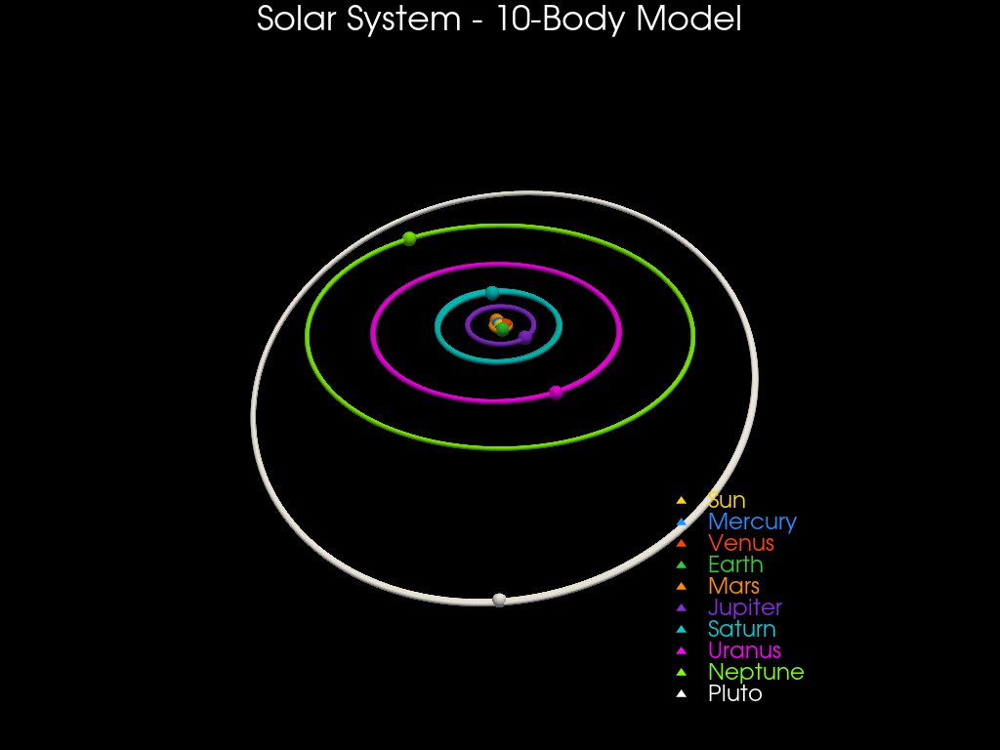

# Yoshida Method: 10-Body Gravitational Simulation



This repository contains an implementation of the **Yoshida Method**, a high-order symplectic integrator designed for the precise simulation of Hamiltonian systems. Here, it is applied to solve the complex dynamics of a 10-body gravitational system (the Solar System) in mutual interaction over long periods of time.

## 🌌 Theoretical Background
Unlike standard numerical integration methods (such as Runge-Kutta), Yoshida's algorithm is *symplectic*, meaning it preserves the phase-space volume of the system. This critical property guarantees that errors in the total energy (the Hamiltonian) are bounded and do not grow linearly over time, allowing for highly stable and accurate integrations in astronomical simulations spanning thousands of years.

The integrator relies on the composition technique developed by **Haruo Yoshida**, where a basic leapfrog integrator is applied over specifically derived fractional time steps. By executing the exact sequence of forward and backward steps, lower-order error terms cancel out perfectly, yielding a robust 4th-order integrator.

### Key Features:
* **High-Order Symplectic Integrator:** 4th-order implementation based on Yoshida's exact coefficients.
* **Strict Energy Conservation:** Superior stability of the Hamiltonian compared to non-conservative methods.
* **$N$-body Problem:** Full gravitational interaction modeling for 10 bodies (Sun + 9 planets/dwarf planets).
* **Cinematic Visualizations:** High-quality 4K 60fps 3D animations and trajectory rendering using **Manim**, alongside standard spatial plotting with **Matplotlib** and **PyVista**.

---

## 📊 Energy Conservation & Stability
The following plots demonstrate the symplectic nature of the integrator, showcasing how the total energy and its residuals remain bounded despite simulating 10,000 physical years at $\Delta t = 0.0005$.


*(Additional 3D spatial render using PyVista)*


---

## 🚀 Data Generation
The raw output files are not included in this repository due to their massive size (~1 GB in total, representing over 20 million integration steps).

> **Instructions:** To render the visualizations and cinematic animations, first execute the `main.ipynb` notebook. This will automatically generate the `momentums.npz` and `positions.npz` files in the `results/` directory. Once generated, the visualization scripts will detect and extract the data dynamically.

---

## 💻 Requirements
To run the numerical engine and compile the animations, you will need:
* Python 3.12+
* NumPy
* Matplotlib (for analytical plots)
* PyVista (for interactive 3D visualizations)
* **Manim Community** (for 4K mathematical animations)

```python
# Quick snippet to load the physical data once generated
import numpy as np

# Load the positions array
data = np.load('results/positions.npz')
positions = data['pos'] # Shape: (timesteps, bodies, coordinates)
print(f"Data successfully loaded. Shape: {positions.shape}")